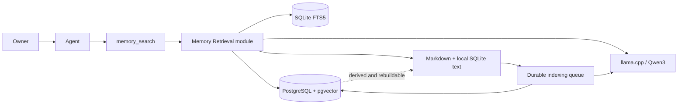

# RFC: Hybrid Semantic Recall for Curated Memory

**Published discussion:** [GitHub issue #1](https://github.com/lenkard/pi-hermes-memory/issues/1)

## 1. Executive decision

- **Problem and target user:** One Agent cannot retrieve Curated Memory by meaning when query wording differs because current search is lexical.
- **Desired outcome:** Improve paraphrase and multilingual Recall@5 materially without regressing exact identifiers, project isolation, safety, latency, or local availability.
- **Recommended smallest approach:** Preserve Markdown authority and SQLite lexical search; add an optional PostgreSQL/pgvector Derived Index populated asynchronously with Qwen3 embeddings; fuse lexical and semantic rankings behind the existing `memory_search` interface.
- **Decision requested:** Approve implementation of the bounded experiment and its thin slices, subject to EP-0001 activation gates.
- **Why now:** The fork is being improved specifically for Semantic Recall, the required owned infrastructure is available and verified, and the current search path has a measurable lexical baseline.

## 2. Traceability

| Capability/decision | Business goal | Hypothesis or guardrail | Evidence/metric | Acceptance evidence |
|---|---|---|---|---|
| Hybrid Recall | BG-01/BG-02 | H-01/H-02 | Paraphrase and exact Recall@5 | Versioned development/holdout results |
| Active Project filtering | BG-03 | G-SCOPE-01 | Wrong-project returned count | Scope/adversarial test report = 0 |
| Read-time safety gate | BG-03 | G-SEC-01 | Unsafe returned count | Adversarial test report = 0 |
| Local lexical fallback | BG-06 | H-03 | Forced-outage success rate | 100% valid fallback within 2 s |
| Asynchronous indexing | BG-07 | H-03 | Write availability and queue convergence | Outage plus reconciliation tests |
| Stable Memory IDs | BG-07 | G-DATA-01 | Identity preserved over replace/delete | Migration and lifecycle tests |
| Exact pgvector search | BG-01/BG-05 | H-01/H-04 | Recall and latency | Exact-search holdout and p95 report |
| Feature flag and kill switch | BG-06 | G-REL-01 | SQLite-only restoration | Configuration/rollback test |

## 3. Facts, assumptions, and unknowns

### Facts

- Markdown is the human-readable authoritative Curated Memory store.
- SQLite mirrors memory and indexes sessions; `memory_search` currently uses FTS5 with no semantic candidate source.
- Current FTS matching falls back from strict term conjunction to broader disjunction, and memory results are primarily ordered by `last_referenced` rather than lexical relevance.
- The package is v0.8.1 at upstream revision `bbd3217d7c98d2a81772a2505f7918c68be8978c`; `npm run check` and `npm test` pass.
- PostgreSQL 17.10 with pgvector 0.8.5 is deployed on `srvpri`, bound only to the same-host Docker bridge, authenticated with SCRAM, backed up daily, and restore-tested.
- llama.cpp build `10015 (12127defd)` serves the pinned Qwen3-Embedding-0.6B Q8_0 model through an authenticated same-host endpoint.
- The model artifact SHA-256 is `06507c7b42688469c4e7298b0a1e16deff06caf291cf0a5b278c308249c3e439`; output is normalized at 1024 dimensions.
- A warm embedding probe measured approximately 142 ms. This is an observation, not an SLO result.
- No existing personal Curated Memory corpus is available for a representative baseline.

### Assumptions to validate

| Assumption | Evidence needed | Owner | Resolve before |
|---|---|---|---|
| Semantic misses are materially costly | Retrieval Evaluation plus usage review | lenkard | Permanent activation |
| Qwen3 Q8_0 improves this corpus | Development and holdout comparisons | lenkard | Activation |
| Exact vector search remains below latency target | Representative load test | lenkard | Activation |
| Policy guidance causes useful `memory_search` calls | Usage diagnostics and owner review | lenkard | Usage-review continuation |
| Reconciliation converges after outages | Seeded drift and forced outage tests | lenkard | Activation |

### Blocking unknowns

- Baseline FTS5 metrics.
- Development-set semantic cutoff and fusion parameters.
- Real-corpus relevance after Curated Memory accumulates.
- Long-term operational cost and model-server contention on the two-core host.

## 4. Scope

- **In scope:** Curated Memory only; stable Memory IDs; local lexical ranking; Qwen3 query/document embedding; metadata-and-vector PostgreSQL index; exact cosine search; equal-weight RRF baseline; deterministic scope/safety gates; asynchronous queue; reconciliation/rebuild/status controls; opt-in configuration; evaluation and diagnostics.
- **Non-goals:** session transcript embeddings; PostgreSQL authority; full memory text in PostgreSQL; multi-Agent sharing; automatic per-turn retrieval; HNSW/IVFFlat; semantic reranker; external embedding provider; public endpoints; replacement of SQLite or Markdown.
- **Constraints:** Existing `memory_search` callers remain compatible. Memory writes and Pi startup cannot depend on PostgreSQL or llama.cpp. Secrets are environment-injected and redacted. The semantic path has a 2-second hard timeout.
- **Guardrails:** Zero wrong-project or unsafe returned memories; exact retrieval cannot regress; public network exposure is prohibited; no raw vectors or credentials in logs/tool text; remote state is always rebuildable.
- **Dependencies:** Pi extension lifecycle; current Markdown and SQLite stores; Node PostgreSQL client; native `fetch`; provisioned PostgreSQL/pgvector and llama.cpp endpoints.

## 5. User behavior and requirements

### Functional requirements

- [ ] FR-01: Existing Curated Memory entries receive stable Memory IDs through a backward-compatible migration.
- [ ] FR-02: New entries receive a Memory ID; replacement preserves it; deletion propagates it.
- [ ] FR-03: Successful authoritative writes enqueue semantic upsert/delete work without waiting for remote services.
- [ ] FR-04: A bounded worker embeds current content and writes metadata plus vector to PostgreSQL idempotently.
- [ ] FR-05: Index Reconciliation repairs missing, stale, changed-contract, and orphaned Derived Index rows.
- [ ] FR-06: `memory_search` obtains lexical and semantic candidates, filters them, fuses rankings, resolves current text, scans it, and returns bounded results.
- [ ] FR-07: Default recall includes global memory, user preferences, categorized lessons, and Active Project memory while excluding other projects.
- [ ] FR-08: Semantic outage or configuration absence produces normal lexical results with bounded diagnostics.
- [ ] FR-09: Status, reconciliation, and confirmed rebuild commands expose safe operational control.
- [ ] FR-10: SQLite-only behavior remains the default until explicit enablement.

### Quality requirements

- **Retrieval:** EP-0001 Recall@5 and no-match thresholds pass on holdout.
- **Security/scope:** Zero wrong-project and unsafe entries enter returned context.
- **Performance:** Warm end-to-end Hybrid Recall p95 ≤750 ms; hard semantic timeout 2 s.
- **Availability:** All forced PostgreSQL/embedding outage cases return valid lexical results within 2 s.
- **Correctness:** Reconciliation repairs 100% of seeded missing, stale, and deleted rows.
- **Compatibility:** Existing configuration and `memory_search` parameters continue to work with semantic search disabled or unavailable.
- **Maintainability:** Callers and tests use the Memory Retrieval interface, not database-specific details.
- **Cost:** Background concurrency, batches, attempts, startup work, CPU, and memory remain bounded as specified.

### Acceptance criteria

- [ ] Given a paraphrased query, when an expected Curated Memory entry exists, then Hybrid Recall meets EP-0001 top-5 thresholds.
- [ ] Given an exact path/command/error query, when FTS5 finds the expected entry, then Hybrid Recall does not rank it below the accepted exact threshold.
- [ ] Given distractors from another project, when searching in an Active Project, then no other-project memory is returned.
- [ ] Given suspicious stored content, when it is a candidate, then it is excluded and the diagnostic records a redacted reason.
- [ ] Given PostgreSQL or llama.cpp is stopped, when `memory_search` runs, then valid lexical results return within two seconds.
- [ ] Given queued work survives restart, when services recover, then bounded processing converges without duplicate authoritative writes.
- [ ] Given a confirmed rebuild, when the Derived Index is deleted and regenerated, then its active Memory IDs and content hashes match authority.

## 6. Existing system and domain context

- **Domain terminology:** Agent, Semantic Recall, Curated Memory, Derived Index, Retrieval Evaluation, Embedding Contract, Hybrid Recall, Index Reconciliation, Memory ID, and Active Project are defined in root `CONTEXT.md`.
- **Relevant code, data, docs, tests, incidents, and decisions:** memory writes originate in `MemoryStore` and `memory` tool handling; SQLite memory search lives in the store/search modules; the Pi tool is the current external seam. ADR-0001 through ADR-0005 capture authority, database, retrieval, consistency, and identity decisions.
- **Existing patterns to reuse:** Markdown mutation locking/atomicity, best-effort mirror warnings, database corruption recovery, bounded session backfill, tool details, configuration defaults, content scanning, and policy-only prompting.
- **Users, systems, and trust boundaries:** The owner controls one Agent. Markdown/SQLite are local trusted authority; stored content remains untrusted for prompting. PostgreSQL and llama.cpp are owned but remote process dependencies. Their responses must be validated and bounded.



## 7. Proposed design

### Modules and responsibilities

**Memory Retrieval module** presents one high-leverage search interface. Its implementation owns query normalization, FTS5 ranking, query instruction, embedding calls, pgvector search, pre-ranking scope filters, fusion, current-text resolution, stale-hash checks, read-time scanning, timeout/fallback, result packing, and diagnostics.

**Derived Index module** owns durable pending work, bounded background processing, idempotent PostgreSQL upsert/delete, Index Reconciliation, confirmed rebuild, status, retry policy, and Embedding Contract state. Authoritative mutation callers report completed memory changes without knowing remote details.

Infrastructure-specific PostgreSQL and embedding clients are internal adapters at remote-owned seams. Deterministic in-memory adapters support interface tests; integration tests exercise the real protocols.

### Interfaces and contracts

A retrieval request carries query text, Active Project, optional target/category/project overrides, result limit, and cancellation. The result carries current Curated Memory records plus scope/provenance, rank explanation, elapsed stages, exclusions, and fallback state. It never exposes raw vectors, credentials, or infrastructure errors containing secrets.

The Derived Index lifecycle accepts authoritative memory changes keyed by Memory ID and can report status, reconcile an authoritative snapshot, and perform a confirmed rebuild. Upsert operations use current authoritative content; delete operations use only Memory ID.

### Data ownership and flow

1. Markdown owns visible content and stable hidden metadata.
2. SQLite mirrors current content, lexical index, Memory ID, and durable semantic work.
3. llama.cpp receives bounded current text or instructed query and returns normalized vectors; it persists no application record.
4. PostgreSQL stores only Memory ID, scope metadata, content hash, contract version, timestamps, and `vector(1024)`.
5. Search resolves PostgreSQL Memory IDs against current local authority before returning text.

### Retrieval behavior

- Lexical candidates use SQLite FTS5 relevance rather than recency-first ordering.
- Semantic queries use the approved Qwen format:

```text
Instruct: Given a query about prior agent knowledge, retrieve the Curated Memory entries most relevant to the current task
Query: {search query}
```

- Stored documents receive no query instruction.
- PostgreSQL filters project/target/category before exact cosine ordering.
- Initial fusion is equal-weight Reciprocal Rank Fusion; recency is a tie-breaker only.
- Development cases tune semantic cutoff/fusion; holdout verifies once.

### Runtime/deployment view

PostgreSQL and llama.cpp run as separate constrained containers on `srvpri`. Each publishes only to the host Docker bridge. PostgreSQL uses SCRAM and a non-superuser role; llama.cpp requires a bearer key and runs non-root with a read-only filesystem and no Linux capabilities. The Pi container receives credentials only at activation.

### Failure containment and recovery

- Search performs no interactive semantic retry and falls back after at most two seconds.
- Background indexing uses one worker, batches of 16, at most 20 startup entries, jittered exponential backoff, and eight automatic attempts.
- Pending work survives Agent restart.
- Reconciliation detects drift by Memory ID, content hash, and Embedding Contract.
- Complete rebuild is never automatic and requires preview plus confirmation.
- PostgreSQL backups are daily and restore-tested, but canonical recovery comes from Markdown because the index is derived.

### Security/privacy controls

- Write-time scanning remains.
- Read-time scanning, current-hash resolution, scope eligibility, and deduplication precede returned context.
- Configuration references environment variables; credentials are absent from repository, Markdown, SQLite diagnostics, tool text, and ordinary JSON.
- Remote payloads, responses, and errors are bounded and validated.
- Current user requests, repository files, and tool evidence override recalled memory.
- Self-hosting is an infrastructure preference, not a claim that embeddings are inherently private or safe.

### Observability

Record bounded counts/timings: lexical candidates, semantic candidates, exclusions by reason, fallback reason, queue pending/failed, last successful reconciliation, contract version, endpoint health, and p50/p95 evaluation latency. Do not record raw vectors, authorization headers, database URLs, or unsanitized memory text.

### Why this is the simplest adequate design

It changes only one user-visible capability behind an existing tool, retains proven local behavior, uses exact search for a small corpus, avoids automatic retrieval and multi-Agent authority, and places all distributed failure behind fallback and reconciliation.

## 8. Alternatives and decisions

| Option | Benefits | Costs/risks | Evidence | Reversal path | Decision |
|---|---|---|---|---|---|
| Do nothing | Zero change | Meaning-only misses remain | Baseline pending | N/A | Comparator |
| Improve FTS5 only | Cheapest and exact-friendly | No semantic representation | Baseline required | Keep as fallback | Included but insufficient if H-01 passes |
| Semantic-only | Simple ranking path | Identifier regressions; no local fallback | Retrieval theory and approved guardrail | Restore FTS fusion | Rejected |
| Qdrant | Purpose-built vector/hybrid features | Specialized additional platform | Primary-source research | Rebuild derived index elsewhere | Rejected by ADR-0002 |
| PostgreSQL + pgvector | Reusable relational platform, filtering, exact/ANN options | More operations than vector-specific service | Infrastructure verified | Disable and rebuild elsewhere | Selected |
| PostgreSQL authority | Central sharing path | Distributed authority/conflicts and local outage dependence | No MVP requirement | Major future RFC | Rejected for MVP |
| Store plaintext in PostgreSQL | One-query remote result payload | Duplicated/stale content and larger data surface | Not required for ID resolution | Add later by migration | Rejected |
| HNSW now | Faster at large corpus | Approximate recall, tuning, build/RAM complexity | No scale evidence | Add when trigger observed | Deferred |
| Automatic retrieval | No explicit tool decision | Every-turn latency/context pollution | No evidence | Feature flag | Rejected for MVP |

## 9. Product data

- **Sources and owners:** Owner-authored or Agent-curated Markdown controlled by lenkard.
- **Contract, schema, semantics, grain, keys, and time:** One Curated Memory entry per Memory ID. Scope is global/user/failure or one project. Canonical created/last-referenced metadata remains local. PostgreSQL grain is one active derived row per Memory ID and current Embedding Contract.
- **Quality/freshness thresholds:** Content hash and contract must match authority before semantic candidates are eligible. Queue lag is visible; lexical fallback covers temporary lag.
- **Duplicates, ordering, lateness, replay, corrections, and deletes:** Existing deduplication remains; upserts are idempotent; replacement preserves Memory ID; queue replay is safe; deletion removes the PostgreSQL row; reconciliation is authoritative.
- **Privacy, access, retention, and lineage:** PostgreSQL contains vectors and minimal metadata but no plaintext. Vectors still require protected access. Derived retention follows canonical deletion. Model/revision/quantization/pooling/dimensions/instruction are versioned.
- **Backup, restore, backfill, and repair:** Markdown and local SQLite remain the recovery source. PostgreSQL backup/restore is tested; backfill/rebuild is explicit; reconciliation repairs incremental drift.

## 10. Security and abuse

- **Assets and threat actors:** Curated knowledge, project association, embeddings, credentials, Agent context; malicious stored content, compromised local container, unauthorized bridge client, dependency/model compromise, accidental cross-project recall.
- **Trust boundaries and entry points:** `memory` writes, Markdown import, embedding HTTP, PostgreSQL TCP, `memory_search` output, operational commands, configuration/environment.
- **Identity and authorization:** Dedicated non-superuser database role; embedding bearer key; bridge-only listeners; no public ports; commands follow Pi user authority and destructive rebuild requires confirmation.
- **Threat/abuse scenarios:** persistent prompt injection, secret-like memory, malicious model response shape, wrong-project filtering, stale vector pointing to replaced content, credential logging, unbounded batches/retries, rebuild without approval.
- **Controls, residual risks, and required approvals:** deterministic scanning/filtering/hash resolution, strict schemas, time/output/concurrency limits, redaction, pinned artifacts, kill switch, human rebuild/activation approval. Embeddings may still leak semantic information to an authorized database reader; single-host compromise remains a residual risk.
- **Security acceptance evidence:** adversarial retrieval cases; listener/public-port checks; unauthorized endpoint tests; secret scanning; scope tests; dependency review; exact image/model digest verification.

## 11. Infrastructure, reliability, and operations

- **Environments/IaC/identity/network:** Versioned Compose and scripts under `infra/postgres/` and `infra/embedding/`; server-specific secrets excluded. Same-host Docker bridge only. Production-like personal environment; no separate staging infrastructure is justified for the MVP.
- **Capacity, availability, overload, and dependencies:** PostgreSQL limited to 1.5 CPU/4 GiB; embedding server limited to 1.5 CPU/3 GiB; one indexing worker and one embedding parallel slot. Exact search remains until measured need for ANN.
- **SLOs and critical journeys:** Search p95 ≤750 ms warm; semantic hard timeout 2 s; authoritative writes remain local during total remote outage; lexical fallback succeeds for all forced-outage cases.
- **Logs, metrics, traces, alerts, owners, and runbooks:** Owner is lenkard. Container health plus extension status/reconciliation commands provide initial observability. Alerts beyond visible status are deferred unless usage evidence justifies ongoing service expectations.
- **RPO/RTO, backup, restore, and incident response:** Unique authoritative-data RPO is not assigned to PostgreSQL because it owns none. Derived RTO is rebuild time; lexical search operates meanwhile. Daily PostgreSQL dumps retain seven days and restore was exercised. Kill switch is the first incident action.
- **Cost budget and alerts:** Use existing infrastructure only. CPU/memory limits are hard bounds. No paid external API or autoscaling.

## 12. Thin vertical slice and delivery

| Increment | Complete user/business evidence | Dependencies | Deterministic checks | Rollback/stop condition |
|---|---|---|---|---|
| 1. Identity and evaluation baseline | Stable Memory IDs plus FTS5 baseline on versioned cases | None | Migration/lifecycle tests; baseline report | Stop if no plausible semantic gap |
| 2. Rebuildable semantic index | One Curated Memory entry can queue, embed, index, reconcile, and delete without blocking writes | 1; provisioned infra | Adapter contracts; real protocol integration; drift tests | Disable worker and delete derived rows |
| 3. Hybrid Recall behind disabled flag | `memory_search` can fuse safe scoped lexical/semantic candidates and fall back | 1–2 | Retrieval behavior, outage, scope, safety, latency tests | SQLite-only flag |
| 4. Operational control and backfill | Status, reconcile, confirmed rebuild, redacted diagnostics | 2–3 | Command and cancellation tests; rebuild equivalence | Keep semantic disabled |
| 5. Activation experiment | Holdout thresholds pass and controlled usage starts | 1–4 | EP-0001 report and approval checklist | Do not activate or use kill switch |

## 13. Validation

| Requirement/risk | Evidence | Exact command/check | Owner |
|---|---|---|---|
| Existing standards | TypeScript and repository tests | `npm run check` and `npm test` | implementer |
| Retrieval quality | Versioned development/holdout report | Implementation MUST add one deterministic semantic-eval command | implementer/reviewer |
| PostgreSQL integration | Migration, exact cosine, filters, idempotent writes | Integration test against pgvector-enabled PostgreSQL | implementer |
| Embedding contract | 1024 normalized dimensions and pinned model identity | Contract test against llama.cpp endpoint | implementer |
| Scope/safety | Zero wrong-project/unsafe returns | Adversarial/scope evaluation suite | reviewer |
| Outage behavior | Valid SQLite fallback under stopped dependencies | Fault-injection integration test | reviewer |
| Reconciliation | Repair seeded missing/stale/deleted rows | Drift integration test | reviewer |
| Infrastructure exposure | Bridge-only listeners and auth rejection | Deployment verification script/manual exact checks | owner |
| Restore | Verified PostgreSQL dump can restore extension/schema | Existing backup service plus restore drill | owner |

Expected results derive from reviewed evaluation fixtures and RFC requirements, not from the implementation under test. Review the final diff separately against repository standards and this RFC.

## 14. Release and rollback

- **Migration and compatibility:** Additive Markdown metadata and SQLite schema migration; legacy entries receive IDs idempotently. Missing semantic config preserves current behavior. PostgreSQL schema is independently creatable/droppable.
- **Rollout/canary/feature control:** Semantic mode defaults off. Run baseline, backfill, development eval, holdout, then owner activation. One Agent is the canary population.
- **Approval gates:** RFC implementation authorization; all EP-0001 activation thresholds; owner review before enabling credentials/flag.
- **Rollback or roll-forward:** Disable semantic flag immediately. Leave or delete derived PostgreSQL rows. Continue local writes and FTS search. Fix and rebuild before reactivation.
- **Production verification:** Status healthy, queue converged, contract matches, holdout report attached, forced fallback passes, listener/auth checks pass, no secret appears in logs/config/diff.

## 15. Outcome and learning

- **Instrumentation linked to Evidence Plan:** ranked IDs, candidate/exclusion counts, stage timing, fallback, queue/reconciliation state, and owner qualitative assessment as defined in EP-0001.
- **Outcome Review date:** Two enabled weeks or 100 semantic searches after activation, whichever is later.
- **Continue/change/pivot/rollback/stop owner:** lenkard.
- **Evidence required before adding complexity:** HNSW requires measured exact-search latency/corpus pressure; automatic retrieval requires observed missed tool calls; multi-Agent sharing requires a separate authority/access/conflict RFC; reranking requires a measured relevance gap after hybrid fusion.

## 16. Risks and open decisions

| Risk/decision | Probability | Impact | Mitigation/experiment | Owner | Due point |
|---|---|---|---|---|---|
| Synthetic evaluation overstates real value | Medium | High | Add owner-reviewed real cases and usage review | lenkard | Usage review |
| CPU contention on two-core host | Medium | Medium | Resource limits, one slot/worker, latency measurement, optional later relocation | lenkard | Activation/operations |
| Query instruction or cutoff overfits development cases | Medium | Medium | Freeze holdout and run once | reviewer | Activation |
| Stable-ID migration damages compatibility | Low | High | Additive metadata, fixtures for legacy formats, backups | implementer | Increment 1 |
| Queue drift or duplicate work | Medium | Medium | Idempotent keys, durable state, reconciliation | implementer | Increment 2 |
| Embeddings reveal semantic information | Low on local bridge | Medium | Auth, bridge-only exposure, minimal metadata, no plaintext | owner | Continuous |
| Upstream Pi/session format changes | Medium | Medium | Preserve existing tool seam and compatibility tests | implementer | Each upgrade |
| Planning docs in upstream are stale | High | Medium | Update agent/roadmap documentation as an early prefactor ticket | maintainer | Before implementation tickets finish |

No blocking design decisions remain. Exact development-set cutoffs and RRF parameters are evidence outputs, not preselected decisions.

## 17. Approval

- [x] Business intent and bounded experiment approved
- [x] Evidence plan reviewed in grilling session
- [x] Architecture, infrastructure, data, security, reliability, and quality decisions reviewed
- [ ] Implementation authorized from published RFC
- [ ] Activation authorized after EP-0001 gates
